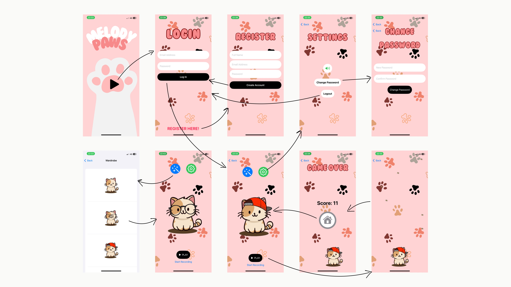

# MelodyPaws

## Overview
MelodyPaws is a captivating game that combines the charm of controlling a cat character with collecting falling items while enjoying a captivating soundtrack. 
With features like customizable background music, character skins, and smooth animations, MelodyPaws offers an engaging and interactive gaming experience for players of all ages.

## Features
- **Registration and Login:** Create an account to access the game and log in with ease.
- **Change Password:** Users have the option to change their password.
- **Character Control:** Maneuver your cat character to collect falling items by dragging them across the screen.
- **Smooth Animation:** Enjoy seamless animations throughout gameplay for an immersive experience.
- **Change Skins:** Personalize your cat character with different skins to suit your style.
- **Background Music:** Customize your gaming experience by enabling background music from a variety of tunes.
- **Scoring System:** Earn points as you collect items during gameplay.

## Technologies Used
- **Frontend:** Swift Language for character control and animation.
- **Backend:** Firebase Database for user registration, login, and password management.
- **Music API:** Integrated media player to enable background music customization.

## Getting Started
To get started with MelodyPaws, follow these steps:
1. Clone the repository: `git clone https://github.com/6410615030/MelodyPaws.git`
2. Open the project in Xcode.
3. Build and run the project on your preferred platform, on simulator or physical device.

## Wireframe

## Members
Natiphon Chanphet 6410615030
Supapan  Ngorsakun 6410615147
